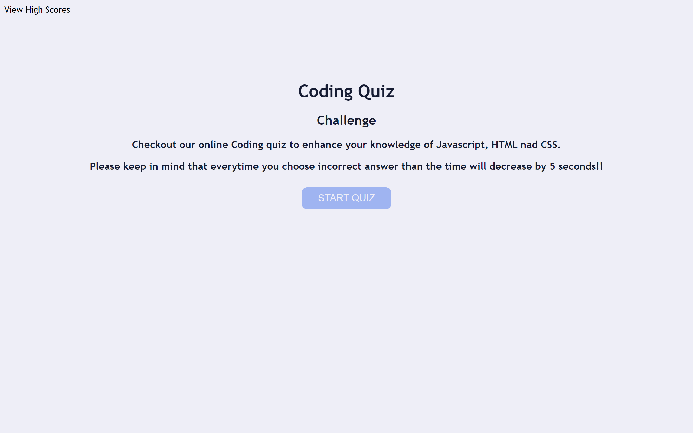

# Fundamental_Coding_Quiz

##

My motivation was to build this Coding Quiz very responsive and attractive, which showcase and highlights all my work skills which i have learned till now. 

I build this Quiz for coding bootcamp students who can test there fundamental knowledge regarding Coding. Furthermore, i build this quiz to showcase it on my portfolio which will help me to build my career as a developer in a real-life.

The Coding Quiz will contain 5 Multiple choice questions which will cover Javascript, HTML and CSS. You have 60 seconds to finish the quiz. When you press the Start Quiz button you will be displayed with first question and also you will notice that the timer will start. Everytime when you will choose incorrect answer than the time will go down by 5 seconds. As soon as you select your answer you will be notified at the bottom of the quiz wether your selected answer is "Correct" or "Wrong". At, the end of Quiz you will be asked to submit your initials. At very end you will be displayed with students High Scores. If you wish to start the Quiz again then press "Go Back" button and it will take you to the starter page of the quiz where you can start taking your quiz again. When you press "Clear High Score" button then it will clear the high score key and value from the local storage.

By building this Coding Quiz i learned some new skills which contains:

I learned how to use local storage to save the data of what user inputs.

Also learned how to implement appendchild function in javascript which will append all my work from js file to HTML.

## Installation

https://parth0415.github.io/Fundamental_Coding_Quiz/

## Usage

## LICENSE
Please refer to the LICENSE in the repository.

